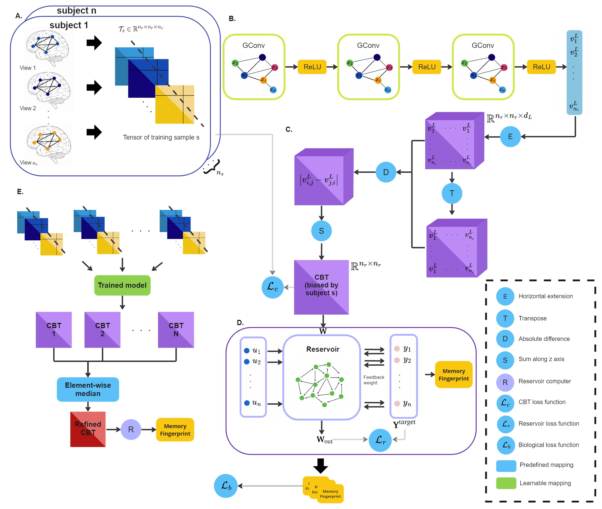

# biological-inspired graph neural network (Bio-GNN)

Please contact yijunlin0621@gmail.com for inquiries. Thanks. 



# Introduction

> **Bio-GNN: Biologically Inspired Graph Neural Network for Population-driven Brain Template Learning**
>
> Yijun Lin and Islem Rekik
>
> BASIRA Lab, Imperial College London
>
> **Abstract:** *The advent of Graph Neural Networks (GNNs) has revolutionized the analysis of biological systems, enabling the exploration of complex interaction patterns for brain networks through creating a connectional brain template (CBT). CBTs have proved to be a powerful tool for studying gender-specific populations as well as healthy and neurologically disordered brain network populations. However, we still lack graph neural network models integrated with biological awareness for fusing multi-view brain networks. Therefore, we introduce a biological-inspired graph neural network. Our main contributions lie in (i) designing Bio-GNN, the first graph neural network model that depicts biological traits, co-optimize the model with a biological task to estimate well-cantered, discriminative and topological sound CBTs; (ii) proposing a novel biological loss to evaluate the biological centredness during model training; (iii) benchmarking with state-of-the-art (SOTA) Deep Graph Normalizer (DGN)  model to evaluate the performance of the estimated CBT and the biological task, results have shown that Bio-GNN outperforms existing models in discriminative testing, demonstrates enhanced biological centeredness, and maintains topological soundness. Our evaluation also demonstrates that Bio-GNN is more powerful in generating population-specific CBTs for Autism spectrum disorder patients and healthy individuals, thereby offering a more precise and reliable tool for distinguishing between the neural connectivity patterns characteristics.*


## Code
This code was implemented using Python 3.8 (Anaconda) on Windows 10.
```diff
 You can edit config.py file to configure our DGN method according to your needs.
```

## Installation
### *Anaconda Installattion*
* Go to  https://www.anaconda.com/products/individual
* Download version for your system (We used Python 3.8  on 64bit Windows 10 )
* Install the platform
* Create a conda environment by typing:  ```conda create –n BIO-GNN pip python=3.8 ```

### *Dependency Installattion*
Copy and paste following commands to install all packages (CPU version)
```sh
$ conda activate BIO-GNN
$ conda install pytorch==1.4.0 torchvision==0.5.0 cpuonly -c pytorch
$ pip install scikit-learn
$ pip install matplotlib
$ pip install torch-scatter==latest+cpu -f https://pytorch-geometric.com/whl/torch-1.4.0.html
$ pip install torch-sparse==latest+cpu -f https://pytorch-geometric.com/whl/torch-1.4.0.html
$ pip install torch-cluster==latest+cpu -f https://pytorch-geometric.com/whl/torch-1.4.0.html
$ pip install torch-spline-conv==latest+cpu -f https://pytorch-geometric.com/whl/torch-1.4.0.html
$ pip install torch-geometric
```
This is all for CPU installation, please visit (optional) PyTorch-Geometric’s web page (https://pytorch-geometric.readthedocs.io/en/latest/notes/installation.html) for description on installing GPU version. Code will check the version of dependencies and availability of GPU. If everything is configured correctly, it will utilize GPU automatically.

## Run BIO-GNN
To run our code, use juputer notebook demo.ipynb